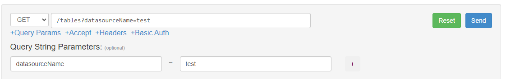
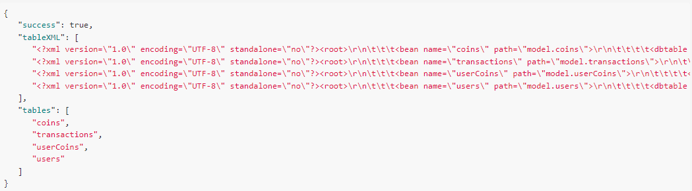
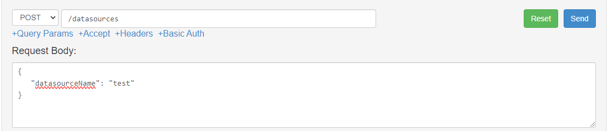
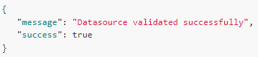

# Code Generator

```
  _____________________
 |  _________________  |
 | | Code Generator  | |
 | |_________________| |
 |  ___ ___ ___   ___  |
 | | 7 | 8 | 9 | | + | |
 | |___|___|___| |___| |
 | | 4 | 5 | 6 | | - | |
 | |___|___|___| |___| |
 | | 1 | 2 | 3 | | x | |
 | |___|___|___| |___| |
 | | . | 0 | = | | / | |
 | |___|___|___| |___| |
 |_____________________|
```

## Table of Contents

- [CFC Generator / API Generator](#cfc-generator--api-generator)
  - [Table of Contents](#table-of-contents)
  - [Ported from: CFC Generator](#ported-from-cfc-generator)
  - [About:](#about)
    - [Improvements:](#improvements)
    - [API:](#api)
  - [Features](#features)
    - [Other features:](#other-features)
  - [Languages](#languages)
  - [Prerequisites](#prerequisites)
  - [Installation](#installation)
    - [Frontend (Vue 3)](#frontend-vue-3)
    - [Backend (ColdFusion / Lucee)](#backend-coldfusion--lucee)
  - [Usage](#usage)
  - [Contributing](#contributing)
  - [License](#license)
  - [References](#references)

## Ported from: [CFC Generator](https://github.com/deanlaw/cfcgenerator)

This is my first real VueJS project, so please don't judge me too harshly. I welcome any suggestions!

## About:

This project is a Vue 3 front-end with a CFML backend that generates code for the selected datasource and table(s). The origial project was created by [deanlaw](https://github.com/deanlaw) that used Flash as a front-end, it also required you to have the CFML Admin password to generate the code.

This version has a Vue 3 frontend and comes with an optional Taffy.io API that delivers the database schema. It does not require the CFML Admin password to work. But you must have a valid Datasource configured on the server you plan to connect to and you must know the Datasource name.

One of the awesome parts from Dean's original project is that he used XSL style-sheets to generate the resulting code with XSL Transform. I have ported his original concept to JS to use the DOMParser() to Transform the XSL on the client side. This allows you to generate the code on your local machine and arrange the paths and folders how you like.

### Improvements:

I improved the XML index file (yac.XML) that describes the templates. I added Category, Subcategory, and Template elements. I also added a Name, Description, and syntax style attributes as well as the language icon. These are displayed in the UI to help the user identify what the template will be building.

I updated the structure of the xml, I included a few icons from [vscode-icons](https://github.com/vscode-icons/vscode-icons/tree/master/icons), feel free to add more as you need other file types.

I removed some of the older template types on the backend, I added a few extra CFML templates as well as some example JS and PHP templates. I added server side caching to the table list per datasource name to cache the database schema after the first run. So you may need to run it a few times, before your first attempt to generate the code.

I set a limit on the total tables returned, since this could lead to time-out requests. I may add table filtering in a feature release. But for now, its limited, feel free to remove this if you need more than 200 tables returned.

There is currently a limit of 1 file created per table. I may revisit this limitation later to address, but for now, you may need to run the tool once for one set of files, and again for a different type.

### API:

I have included a [Taffy.io](https://taffy.io/) API that is preconfigured, and can connect to any datasource configured in your Coldfusion/Lucee Server, given you know the Datasource name. You can use this API or you can use what ever API you want to generate the Table XML and datasource name validation, just modify the config.js files to point to your API. The defualt is:

```
API_BASE_URL=http://localhost:8080/api/index.cfm?endpoint=
```

The API only has 2 endpoints:

`GET: /tables`
Will return all the tables in the selected datasource as a structure:

```JSON
{
  "success": true,
  "tableXML": [
    "<xml.....",
    "<xml.....",
    "<xml....."
  ],
  "tables": [
    "table1",
    "table2",
    "table3"
  ]
}
```




`POST: /datasource`
Will return true if the given datasource name is valid and exists.

```JSON
{
  "message": "Datasource validated successfully",
  "success": true
}
```




## Features

- Generate Code based on a database table XML
- config.js to control paths, urls, debug, max tables.
- Supported Database Types:
  - MySQL (v4 & v5+)
  - PostgreSQL (coming soon)
  - Microsoft SQL Server
  - Oracle (incomplete)
  - Informix (incomplete)
- XSLT Templates for Code Generation
  - Easy to modify
  - Simple to add new templates
  - Supports almost any programming language
- Included Templates:
  - CFML
    - Taffy API (DAO and Service)
    - ORM CFC's (Tag and Script)
    - CF DAO's
    - CF Service's
    - CF Bean's
  - JS
    - Express Routes
    - Sequelize Model
    - DAO
    - Model
  - PHP Laravel
    - API Controller
    - API Routes
    - Model

### Other features:

These templates are easy to modify to your liking, and you are not limited to using this for ColdFusion, you can use it for any language that you want, just make the new templates and style-sheets.

## Languages

- Vue 3 with `<script setup>` SFCs
- ColdFusion / Lucee backend (CFML)
  - Taffy.io API for Datasource and Table XML generation (JSON/REST)

## Prerequisites

- Node.js (>= 14.x)
- npm (>= 6.x)
- CommandBox, ColdFusion or Lucee server
  - Taffy.io
  - Or any other API that can return the required Table XML

## Installation

### Frontend (Vue 3)

1. Clone the repository:

   ```sh
   git clone https://github.com/chewymole/cfcGenerator.git
   cd cfc-generator
   ```

2. Install dependencies:

   ```sh
   npm install
   ```

3. Start the development server:

   ```sh
   npm run dev:all
   ```

### Backend (ColdFusion / Lucee)

1. Ensure you have a CFML server running. Or use your own API server.
2. If you are using the included CommandBox server, You MUST setup a valid Datasource. If you are using your own API server, you must know the datasource name.
3. You can use the included CommandBox server by running `npm run api`

   1. Or deploy the `api` folder to your server.

4. Configure the `/public/config.js` to make sure the base url path to the /xsl file is correct. If you are hosting in a subdirectory, this should be: `/myfolder/path/to/index.html`

   1. ```json
      window.APP_CONFIG = {
      BASE_URL: "/",
      API_URL: "http://localhost:8080/?endpoint=",
      DEBUG_MODE:true
      };
      ```

5. If you roll your own API, use the included code as a starter.

   1. The frontend expects the following endpoints:
      `GET:/tables?datasourceName=`<datasource name>
      `POST:/datasource { "datasourceName":"<datasource name>" }`
      Use the `/resources` as a starting point, then review the code in the `/model/` for how to parse the different database types and how it generates the table XML.

6. Path issues:

   1. If you plan to deploy the /api to a subfolder on your server, review the config.js files. These are needed to point to the correct folder that contains the XML/XSL files. If you get a blank screen, check this first.
   2. If you deploy to the root folder, just make sure to verify the config.js files are using the correct paths and API url's
   3. If you are using the included API, and you are not able to browse to the API dashboard, make sure your CF server is running and the ports are correct. Also if you have this deployed to a subfolder, you may need to Login to the admin server and create a mapping to taffy. should be something like /taffy = {your installed folder for taffy}

## Usage

1. Access the Vue 3 frontend at `http://localhost:3000` (or the port specified in your Vite config). Or run `npm build` and deploy the `dist` folder to your server.
2. Use the interface to Enter the Datasource Name, then select the Tables you want to generate code for, then select the template you want to use.
3. Click the Generate Code button.
4. Review the generated code, then click the Save or Save All buttons to download the generated code to your local machine.
5. From there, review the code in your editor of choice and make the needed adjustments for your environment and deploy to your testing server for review.
6. Have fun.
7. I thank my Lord and Savior Jesus Christ for this blessing to be able to share this small part of my life with you. If you have any questions, please feel free to contact me.

## Contributing

1. Fork the repository.
2. Create a new branch (`git checkout -b feature-branch`).
3. Make your changes.
4. Commit your changes (`git commit -m 'Add some feature'`).
5. Push to the branch (`git push origin feature-branch`).
6. Open a pull request.

## License

This project is licensed under the MIT License. See the [LICENSE](LICENSE) file for details.

## References

- [Vue 3 Documentation](https://v3.vuejs.org/)
- [Vite Documentation](https://vitejs.dev/)
- [ColdFusion Documentation](https://helpx.adobe.com/coldfusion/user-guide.html)
- [Lucee Documentation](https://docs.lucee.org/)
- [Taffy.io Documentation](https://taffy.io/)
